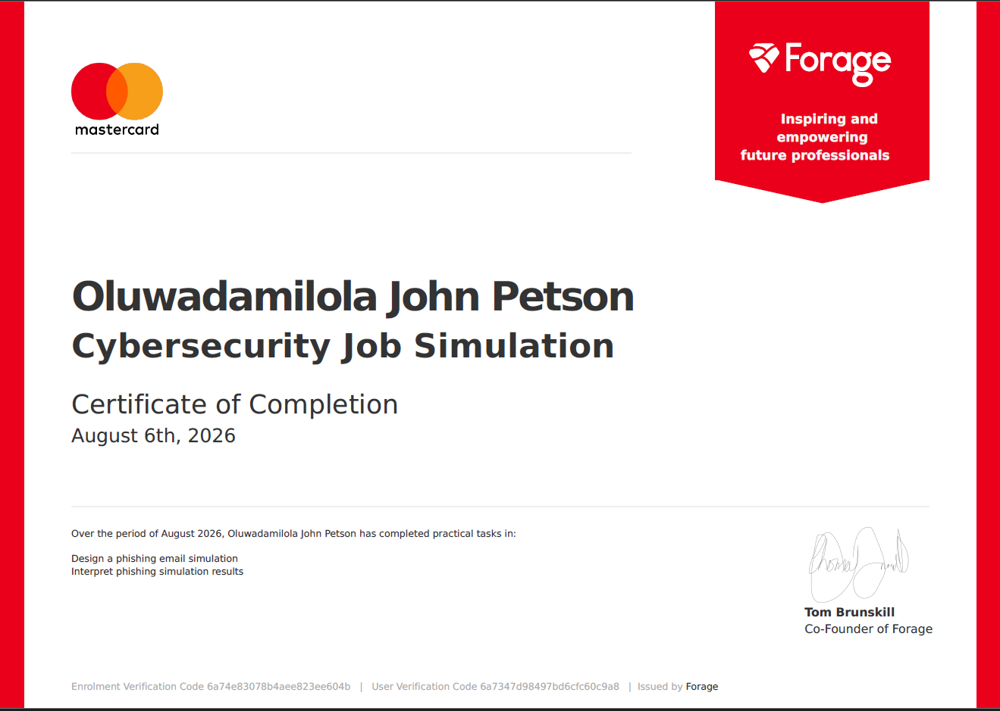
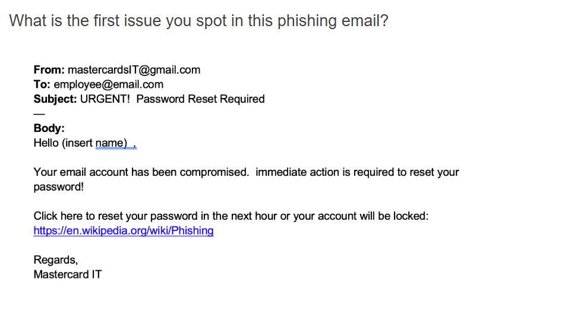
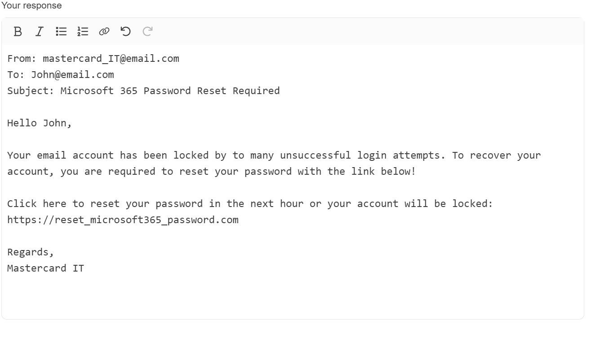
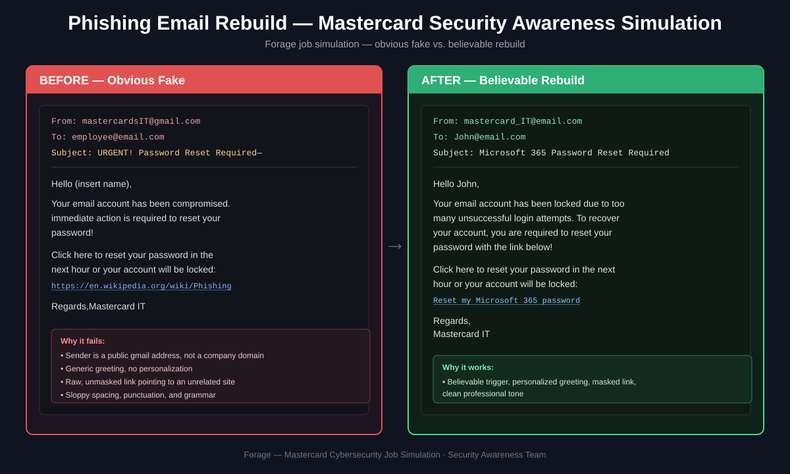
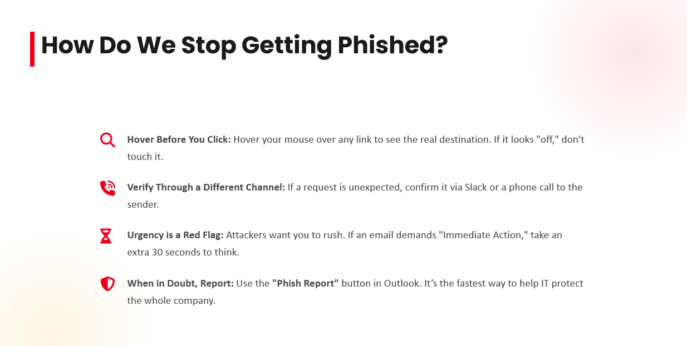

**Platform:** Forage
**Company:** Mastercard
**Date completed:** August 6, 2026
**Role simulated:** Security Awareness Team Analyst

---

## Overview

This simulation put me in the role of a Security Awareness Analyst. The task was to rebuild a weak phishing email into something believable, then look at simulation results across departments and figure out which teams needed more training.

---

## The original phishing email (the weak version)

Mastercard's Security Awareness Team had previously caught a real phishing attempt aimed at employees. It failed because it was an obvious fake. This was the starting point I was given to improve.

**Why it didn't work:**

| Sign | Why it's a red flag |
|---|---|
| Sender address was a public Gmail account | A real company would never send internal IT notices from a free email provider |
| Message created panic ("your account has been compromised") | Real IT departments rarely use scare tactics like this, and panic makes people click without thinking, which is actually the giveaway |
| The link went to a random Wikipedia page | A real reset link would match the company's own website, not point somewhere unrelated |
| No name, no personal detail | Real internal emails usually greet you by name |
| Sloppy spelling and spacing | Professional companies proofread their communications |

The point of walking through this first was to build a mental checklist for spotting phishing before trying to write a convincing one.

---

## My rebuild

Once I understood what made the original obviously fake, the task was to fix each of those weaknesses and turn it into something a real employee might actually fall for.

**What I changed and why:**

- Swapped the Gmail sender with email as an internal company email will have the same email name, since that removes the biggest giveaway
- Replaced "your account has been compromised" with "too many failed login attempts," a much more mundane, believable reason that doesn't feel dramatic enough to trigger suspicion
- Added the employee's actual name, since personalization makes people trust a message faster
- Masked the link behind normal looking text instead of showing a raw URL
- Cleaned up the grammar and formatting to look like something written by a real IT department

Each change directly targets one of the weaknesses identified above, the goal was showing I understood which specific gaps to close and why each fix works.

---

## Before and after, side by side

Putting them next to each other makes the pattern clear: every fix on the right directly answers a weakness on the left. Nothing was changed randomly, each change closes a specific gap an employee might have caught.

---

##  Turning results into training people will actually use

After the simulation ran, I was given department level data and asked to figure out where more training was needed.

| Team                | Email open rate | Click through rate | Phishing success rate |
| ------------------- | --------------- | ------------------ | --------------------- |
| HR                  | 100%            | 85%                | 75%                   |
| Marketing           | 65%             | 40%                | 38%                   |
| Card Services       | 60%             | 50%                | 10%                   |
| Engineering         | 70%             | 4%                 | 1%                    |
| R&D                 | 50%             | 5%                 | 2%                    |
| Reception           | 40%             | 10%                | 0%                    |
| IT                  | 80%             | 2%                 | 0%                    |
| **Overall average** | **66%**         | **28%**            | **18%**               |

HR and Marketing stood out well above the average on every measure, with HR having the worst outcome of any team. That's not a knock on either team, it's a pattern. Both roles involve opening emails from people they don't know as a normal part of the job (job applicants, external partners, campaign contacts), so the habit of trusting an unfamiliar email is already built into how they work. That's exactly what phishing takes advantage of.

I built a short, 4 slide training outline aimed at these two teams. The goal was to make it something people would actually sit through, not another generic "watch out for suspicious emails" slide deck.

**What the training covered, slide by slide:**

1. **What phishing actually is**: Explained in plain terms, no jargon, focused on what it looks like from the receiving end
2. **The exact tricks used in this campaign**: The fake sender, the urgency, the hidden link, shown using the real example from this simulation so it feels concrete instead of abstract
3. **A quick "spot the fake" exercise**: A short, interactive moment so the team practices the skill instead of just hearing about it
4. **What to do if you spot one**: A simple, one step reporting reminder, since training only works if people know what action to take afterward

The bigger lesson from this part was less about phishing and more about communication: technical findings only matter if the people receiving them can act on them. Data has to turn into something short, specific, and usable, not just accurate.

---

## Skills demonstrated

Communication, Data Analysis, Data Visualization, Design Thinking, Problem Solving, Security Awareness, Security Training, Strategy

## Application to SOC and Security Awareness roles

This maps directly onto real security awareness work: reading a phishing attempt, understanding why it succeeds or fails, and turning results into training that targets an actual behavior gap instead of repeating generic advice. It also lines up with what I'm doing right now at NCC, where I'm designing phishing simulation campaigns for a federal regulatory body, so I have a real comparison point between how a global fintech runs this program versus a government agency.
